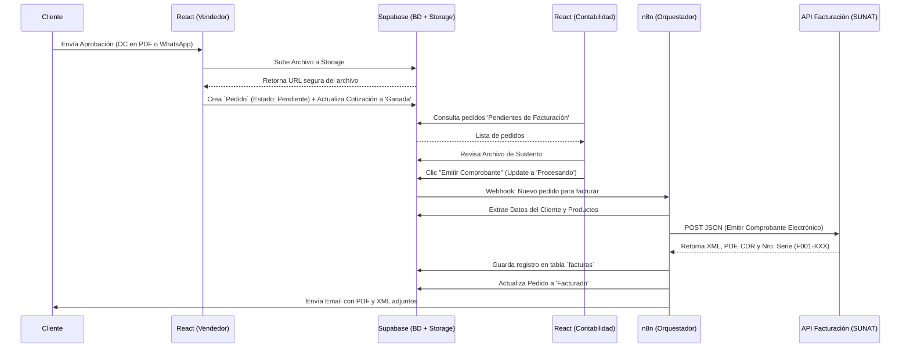

# 📄 DOC 6: Flujo Lógico de Pedidos (Órdenes de Compra) y Facturación

## 🎯 Objetivo del Módulo
Transformar una Cotización enviada en un **Pedido en firme** mediante el registro del sustento del cliente (Orden de Compra o captura de aprobación), para posteriormente delegar la emisión del **Comprobante Electrónico (Factura/Boleta)** al área contable y automatizar su envío a través de n8n y proveedores de SUNAT.

---

## 🧑‍💻 FASE 1: Aprobación y Creación del Pedido (Rol: Ventas)

Esta fase ocurre en el Frontend (React) y es ejecutada por el **Vendedor**.

1. **Recepción de Confirmación:** El vendedor recibe la aprobación del cliente por correo electrónico (adjuntando un PDF de su Orden de Compra) o por WhatsApp.
2. **Interacción en React:**
   * El vendedor ingresa al módulo de `Cotizaciones`.
   * Filtra las cotizaciones con estado `"Enviada"`.
   * Selecciona la cotización correspondiente, hace clic en el botón de acción: **"Generar Pedido"**.
3. **Validación de Sustentos (Modal):**
   * Se abre un Pop-up. El sistema solicita:
     * `Nro. de OC del Cliente`: **Opcional** (Ej: *OC-45091*).
     * `Sustento de Aprobación`: **Obligatorio**. El vendedor debe arrastrar y soltar el archivo PDF de la OC o la captura de pantalla de WhatsApp (.jpg, .png).
     * `Fecha de Pedido`: **Opcional** (Fecha en la que se genera el pedido).
     * `Observaciones`: **Opcional** (Observaciones o instrucciones adicionales que figuren en la OC o del vendedor "por ejemplo: "pago en 30 días" o "entrega en obra"").
4. **Procesamiento (Supabase):**
   * Al hacer clic en "Guardar", React sube el archivo al bucket de Supabase Storage llamado `sustentos_aprobacion`.
   * Supabase Storage devuelve la URL pública/segura del archivo.
   * Se inserta un nuevo registro en la tabla `pedidos` vinculando el ID de la cotización y guardando la URL del archivo.
   * Se actualiza la tabla `cotizaciones`, cambiando su estado a **`"Aprobada"`**.
   * El estado inicial del nuevo pedido será **`"Pendiente Facturación"`**.

---

## 👩‍💼 FASE 2: Revisión y Emisión (Rol: Contabilidad / Administrador)

Esta fase garantiza que el equipo de ventas no emita facturas directamente. Es ejecutada en React por un usuario con rol **Admin** o **Contabilidad**.

1. **Bandeja de Entrada Contable:**
   * El usuario de contabilidad ingresa al módulo de `Facturación` en React.
   * Visualiza un listado de todos los pedidos en estado `"Pendiente Facturación"`.
2. **Auditoría Visual:**
   * El usuario hace clic en un pedido para revisarlo.
   * El sistema le muestra un botón para **"Ver Sustento"** (Abre el PDF o imagen que subió el vendedor para corroborar que la venta es real y los montos cuadran).
3. **Disparo de Facturación:**
   * Si todo es correcto, el usuario selecciona el tipo de comprobante (Factura o Boleta, basado en si el cliente tiene RUC o DNI).
   * El usuario llena los campos que faltan para la factura (Ej: dirección de facturación si es diferente a la del cliente, datos para pago de detracciones, etc).
   * Hace clic en el botón primario: **"Emitir Comprobante Electrónico"**.
4. **Procesamiento Interno:**
   * React actualiza el estado del pedido en Supabase a **`"Procesando Facturación"`**.
   * Este cambio de estado dispara automáticamente un **Webhook** hacia n8n.

---

## 🤖 FASE 3: Orquestación y SUNAT (Rol: n8n + API Facturación)

Este es el **Workflow 3** en n8n. Es un flujo *Backend* 100% invisible para el usuario, que se encarga de hablar con la SUNAT y notificar al cliente.

1. **Trigger (Webhook):** n8n recibe la alerta indicando que un pedido necesita ser facturado.
2. **Gathering (Recopilación de Datos):**
   * n8n consulta la base de datos (Supabase) para obtener: Datos del cliente (RUC, Razón Social, Dirección), detalles de los ítems cotizados (Cantidades, Precios, IGV), y el Nro. de Orden de Compra del cliente (si existe, para incluirlo en la factura como referencia) y datos adicionales para la factura.
3. **Petición a Proveedor Electrónico (HTTP Request):**
   * n8n mapea los datos a la estructura JSON requerida por el proveedor de facturación (Ej: *ApisPeru* o *Facturador.pe*).
   * n8n envía el POST Request a la API del proveedor.
4. **Recepción de Comprobante:**
   * La API responde con éxito, devolviendo: `Serie y Número` (Ej: F001-00024), `Enlace al PDF de la Factura`, `Enlace al XML` y `Enlace al CDR` (Constancia de Recepción de SUNAT).
5. **Descarga y Respaldo en Supabase Storage (HTTP Request 2 & 3):**
   * n8n descarga el PDF y el XML utilizando las URLs proporcionadas por el proveedor.
   * n8n sube estos archivos binarios directamente a un nuevo bucket en tu Supabase llamado facturas_emitidas.
   * Nomenclatura recomendada: F001-00024_RUC_Cliente.pdf y F001-00024_RUC_Cliente.xml.
6. **Actualización de Base de Datos (Postgres Node):**
   * n8n inserta un nuevo registro en la tabla `facturas` guardando todos los enlaces y el número de serie.
   * Importante: Guarda las URLs internas de tu Supabase Storage (no las del proveedor) en los campos enlace_pdf y enlace_xml.
   * Actualiza el registro en la tabla `pedidos`, cambiando su estado a **`"Facturado"`**.
6. **Notificación al Cliente (Gmail Node):**
   * n8n redacta el correo: Asunto: Factura Electrónica [F001-00024] - [Tu Empresa SAC].
   * Adjunta los archivos PDF y XML que acaba de procesar.
   * Envía el correo. **Fin del Flujo.**

---

## 📊 Diagrama Visual del Flujo (Mermaid)

*Copia este bloque en Notion o Mermaid Live para visualizar el diagrama.*

---

### 💡 Notas Técnicas de Implementación para React + Supabase:

1. **Configuración de RLS (Row Level Security):** Al crear el bucket `sustentos_aprobacion` en Supabase Storage, asegúrate de configurarlo como **Privado**, no público. Así evitas que la información financiera de tus clientes quede expuesta en internet.
2. **Manejo de Errores de SUNAT:** En n8n, debes agregar un "Nodo Catch" o "If Error". Si la API del proveedor de facturación electrónica devuelve un error (ej. "RUC no válido" o "SUNAT caído"), n8n debe actualizar el pedido en Supabase a **`"Error de Facturación"`** para que Contabilidad lo vea en rojo en su dashboard de React y corrija el dato.