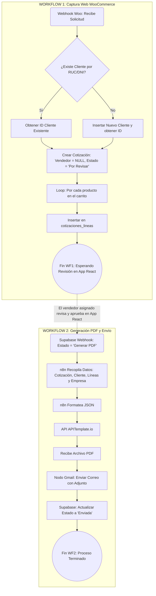

# 📄 DOC 2: Diagrama de Flujo Lógico (Process Flowchart) - Orquestación en n8n

Este documento define la lógica de enrutamiento y toma de decisiones (el "cerebro") que configuraremos en n8n. Se divide en dos flujos de trabajo (Workflows) independientes.

## WORKFLOW 1: Captura Web Automatizada (De WooCommerce a Supabase)

**Objetivo:** Recibir la solicitud de la web, evitar clientes duplicados usando su RUC/DNI y crear el borrador para que el equipo comercial lo asigne y revise.

**Paso a Paso Lógico:**

1. **Trigger (Webhook):** n8n recibe el paquete de datos (JSON) desde WooCommerce apenas el cliente presiona "Solicitar Cotización".
2. **Validación de Cliente (Búsqueda por RUC):**
    * n8n extrae el `numero_documento` (RUC/DNI) del paquete.
    * Ejecuta una consulta en Supabase: `SELECT id FROM clientes WHERE numero_documento = {{RUC}}`.
3. **Condicional (Nodo IF):** ¿El cliente ya existe?
    * **Camino A (Sí existe):** Extrae el `cliente_id` existente (y opcionalmente actualiza su teléfono o correo si cambiaron).
    * **Camino B (No existe):** Ejecuta un `INSERT` en la tabla `clientes` con los datos nuevos y obtiene el nuevo `cliente_id`.
4. **Creación de Cabecera (Cotización):**
    * Ejecuta un `INSERT` en `cotizaciones`.
    * *Parámetros clave:* `cliente_id` = (el obtenido en paso 3), `origen` = 'Web', `vendedor_id` = **NULL**, `estado` = 'Por Revisar', `woo_order_id` = (ID del pedido de Woo).
5. **Bucle de Productos (Nodo Loop):**
    * n8n separa la lista de productos que vienen de WooCommerce.
    * Por cada producto, ejecuta un `INSERT` en `cotizaciones_lineas`.
    * *Nota:* Como vienen de la web, guardamos directamente el `nombre`, `cantidad` y `precio` en la línea, dejando el `producto_id` de nuestra base de datos opcional (por si el SKU no coincide).
6. **Fin del Flujo:** El sistema queda a la espera de que el Administrador abra la Aplicación React, vea la cotización "Por Revisar", le asigne un vendedor y modifique los precios si es necesario.

---

## WORKFLOW 2: Motor de PDF y Despacho (De Aplicación React/Supabase al Cliente)

**Objetivo:** Reaccionar cuando un vendedor aprueba la cotización, generar el documento visual y enviarlo por correo.

**Paso a Paso Lógico:**

1. **Trigger (Database Webhook):** Supabase detecta que en la Aplicación React alguien cambió el campo `estado` de una cotización a **'Generar PDF'**. Supabase dispara una alerta instantánea a n8n.
2. **Recolección de Datos (Gathering):**
    * n8n hace un `SELECT` a `cotizaciones` para traer los totales (Subtotal, IGV).
    * n8n hace un `SELECT` a `clientes` para traer el correo y RUC.
    * n8n hace un `SELECT` a `empresa_configuracion` para traer tus textos legales y cuentas bancarias.
    * n8n hace un `SELECT` a `cotizaciones_lineas` para traer la lista de productos.
3. **Formateo de Datos (Nodo Set / Code):** Construye el JSON estructurado que exige APITemplate.io.
4. **Generación de Documento (Nodo HTTP Request):**
    * Envía el JSON a la API de APITemplate.io.
    * La API responde con un archivo PDF (o una URL de descarga temporal).
5. **Despacho por Correo (Nodo Gmail):**
    * Arma el correo usando el email del cliente.
    * Asunto: *"Cotización {{numero_correlativo}} - {{razon_social_empresa}}"*.
    * Cuerpo del correo: Texto amigable invitando a revisar el adjunto.
    * Adjunta el PDF.
6. **Actualización Final (Nodo Postgres):**
    * Ejecuta un `UPDATE cotizaciones SET estado = 'Enviada' WHERE id = {{cotizacion_id}}`.
7. **Fin del Flujo.**

---

### 🎨 Visualización del Flujo (Código Mermaid)

*Puedes copiar este bloque de código y pegarlo en Notion (creando un bloque tipo "Mermaid") o en [Mermaid Live Editor](https://mermaid.live/) para ver el diagrama de flujo dibujado automáticamente.*

---

### Análisis Técnico Rápido

Con este diseño hemos logrado aislar completamente la "Entrada" de la "Salida".

* **Si WooCommerce se cae**, tus vendedores pueden seguir usando la Aplicación React para generar cotizaciones e iniciar el Workflow 2.
* **Si APITemplate se cae**, WooCommerce sigue recibiendo cotizaciones en el Workflow 1, se guardan a salvo en tu base de datos, y puedes generar los PDFs más tarde.
¡Es una arquitectura a prueba de fallos!
